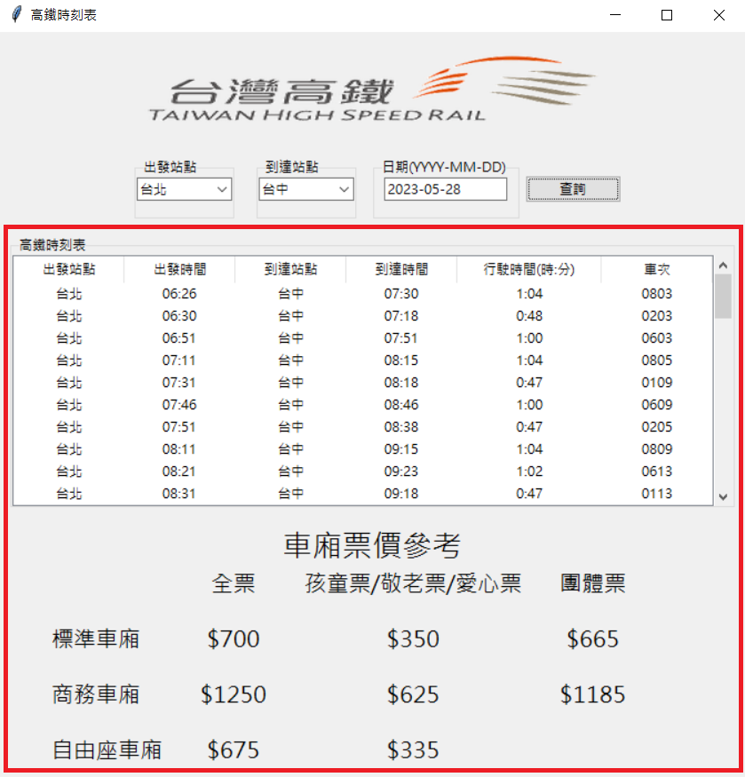

# 高鐵時刻表
## 主程式main.py
- 抓取資料引用至TDX運輸資訊整合流通服務平台
- 注意: 因此平台之API每日有使用次數限制，如需多次使用要申請此平台之會員並獲取金鑰，並自行修改datasource.py之程式碼
### 可提供查詢高鐵時間，並會同時顯示票價

### 1.請點選'出發站點'與'到達站點'並輸入'日期'後點擊查詢

### 2.就會顯示出所選站點的所有時刻表，還有所需的票價
